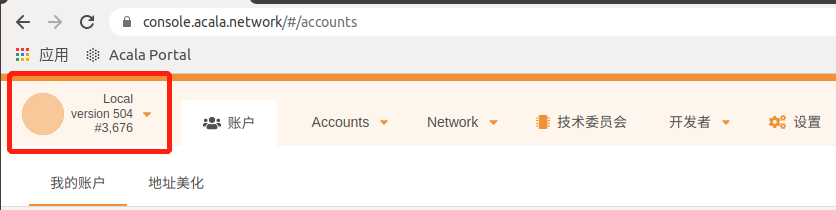
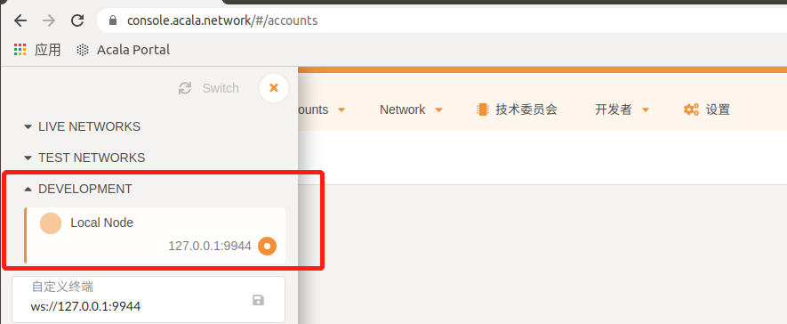
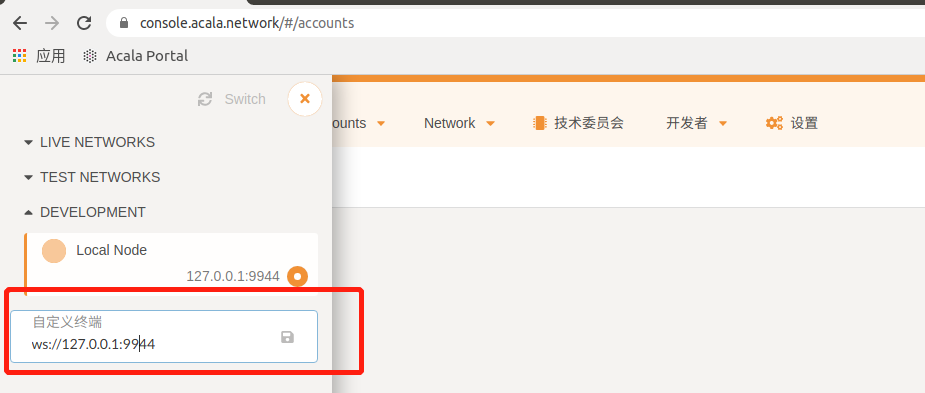
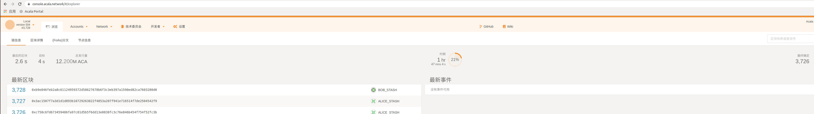
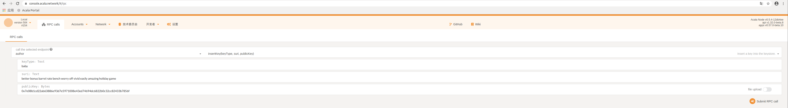

### **创建和编译节点程序**

1. 安装系统依赖包

   ```shell
   sudo apt update
   sudo apt install -y cmake pkg-config libssl-dev git gcc build-essential clang libclang-dev
   ```

2. 安装 Rust 工具链（如果之前已经装过 Rust 工具链，此步骤可跳过）

   ```shell
   curl https://sh.rustup.rs -sSf | sh -s -- -y
   source ~/.cargo/env
   rustup default stable
   rustup update nightly
   ```


### 编译安装 Acala 工程

1. 下载 github  项目

   ```shell
   git config --global submodule.recurse true
   git clone git@github.com:AcalaNetwork/Acala.git
   ```

2.  初始化 WASM 的构建环境

   ```shell
   make init
   ```

3.  编译构建

   ```shell
   make build
   ```


### 使用 dev  链

Makefile 中的所有 build 命令都是为本地开发目的而设计的，因此可以`SKIP_WASM_BUILD` 加快构建时间，`--execution native` 仅用于运行本机执行模式。

#### 运行

开始运行一条指定 `--chain` 为 dev 的链

```shell
make run
```


#### 运行所有编译器的检查，但不生成最终的二进制文件

```shell
make check
```


#### 清除旧的链数据

```shell
make purge
```


#### 清除旧的链数据并运行

```shell
make restart
```


#### 更新 ORML

```shell
make update
```


### 本地多节点测试网络

#### 启动 Alice 和 Bob

`local` 两个预先定义的（不是私有）密钥，称为 Alice 和 Bob

##### 先启动 Alice

```shell
./acala --base-path /tmp/alice --chain local --alice --port 30333 --ws-port 9944 --rpc-port 9933  --validator --rpc-methods=Unsafe --ws-external --rpc-external --ws-max-connections 1000 --rpc-cors=all --unsafe-ws-external --unsafe-rpc-external
```

| 参数                    | 说明                                                         |
| :---------------------- | ------------------------------------------------------------ |
| `--base-path`           | 存储与该链有关的所有数据的目录。如果目录不存在，将为您创建目录。如果其他区块链数据已经存在，您将得到一个错误。清除目录或选择其他目录。如果未指定此值，将使用默认路径 |
| `--chain `              | 指定要使用的链规范。有几个预包装选择，包括`local`，`mandala`，但一般一个指定自己 chainspec 文件。我们将在以后的步骤中指定我们自己的文件 |
| `--alice`               | 将预定义的 Alice 密钥（用于块生产和最终确定）放入节点的密钥库中。通常，应该生成自己的密钥，并通过 RPC 调用将其插入。我们将在以后的步骤中生成自己的密钥。此标志还使 Alice 成为验证者 |
| `--port`                | 指定您的节点将在其上侦听 p2p 流量的端口。`30333`是默认值，如果您对默认值感到满意，则可以省略此标志。如果 Bob 的节点将在同一物理系统上运行，则需要为其明确指定其他端口，端口不能冲突 |
| `--ws-port`             | 指定您的节点将侦听其上传入的 Web socket 的端口。`9944`是默认设置，因此也可以省略 |
| `--rpc-port `           | 指定节点将在其上侦听传入的 RPC 通信的端口。`9933`是默认设置，因此也可以省略 |
| `--rpc-methods`         | 指定 RPC 的安全是否安全，若指定 `Unsafe` ，在生产环境中使用此标志并不安全 |
| `--ws-external`         | 监听所有 Websocket 接口                                      |
| `--rpc-external`        | 监听所有 RPC 接口                                            |
| `--ws-max-connections`  | 最大 WS-RPC 服务器连接数                                     |
| `--rpc-cors`            | 指定允许访问 HTTP & WS RPC 服务器的浏览器源                  |
| `--unsafe-ws-external`  | 监听所有 Websocket 接口                                      |
| `--unsafe-rpc-external` | 监听所有 RPC 接口                                            |

当节点启动时，您应该会看到类似的输出

```shell
2020-09-03 16:08:05.097 main WARN sc_cli::commands::run_cmd  It isn't safe to expose RPC publicly without a proxy server that filters available set of RPC methods.
2020-09-03 16:08:05.098 main WARN sc_cli::commands::run_cmd  It isn't safe to expose RPC publicly without a proxy server that filters available set of RPC methods.
2020-09-03 16:08:05.098 main INFO sc_cli::runner  Acala Node
2020-09-03 16:08:05.098 main INFO sc_cli::runner  ✌️  version 0.5.4-12db4ee-x86_64-linux-gnu
2020-09-03 16:08:05.098 main INFO sc_cli::runner  ❤️  by Acala Developers, 2019-2020
2020-09-03 16:08:05.098 main INFO sc_cli::runner  📋 Chain specification: Local
2020-09-03 16:08:05.098 main INFO sc_cli::runner  🏷  Node name: Alice
2020-09-03 16:08:05.098 main INFO sc_cli::runner  👤 Role: AUTHORITY
2020-09-03 16:08:05.098 main INFO sc_cli::runner  💾 Database: RocksDb at /tmp/node01/chains/local/db
2020-09-03 16:08:05.098 main INFO sc_cli::runner  ⛓  Native runtime: acala-504 (acala-0.tx1.au1)
2020-09-03 16:08:05.801 main WARN sc_service::builder  Using default protocol ID "sup" because none is configured in the chain specs
2020-09-03 16:08:05.801 main INFO sub-libp2p  🏷  Local node identity is: 12D3KooWNHQzppSeTxsjNjiX6NFW1VCXSJyMBHS48QBmmGs4B3B9 (legacy representation: Qmd49Akgjr9cLgb9MBerkWcqXiUQA7Z6Sc1WpwuwJ6Gv1p)
2020-09-03 16:08:07.117 main INFO sc_service::builder  📦 Highest known block at #3609
2020-09-03 16:08:07.119 tokio-runtime-worker INFO substrate_prometheus_endpoint::known_os  〽️ Prometheus server started at 127.0.0.1:9615
2020-09-03 16:08:07.128 main INFO babe  👶 Starting BABE Authorship worker
2020-09-03 16:08:09.834 tokio-runtime-worker INFO sub-libp2p  🔍 Discovered new external address for our node: /ip4/192.168.145.129/tcp/30333/p2p/12D3KooWNHQzppSeTxsjNjiX6NFW1VCXSJyMBHS48QBmmGs4B3B9
2020-09-03 16:08:09.878 tokio-runtime-worker INFO sub-libp2p  🔍 Discovered new external address for our node: /ip4/127.0.0.1/tcp/30333/p2p/12D3KooWNHQzppSeTxsjNjiX6NFW1VCXSJyMBHS48QBmmGs4B3B9
2020-09-03 16:08:12.103 tokio-runtime-worker INFO sc_basic_authorship::basic_authorship  🙌 Starting consensus session on top of parent 0x707ff23a491ce28d410d6d070b86b48eb0d546b185797e5b598c1cfe07aa59e8
2020-09-03 16:08:12.157 tokio-runtime-worker INFO substrate  💤 Idle (1 peers), best: #3609 (0x707f…59e8), finalized #3607 (0xb733…0a48), ⬇ 1.6kiB/s ⬆ 1.6kiB/s
2020-09-03 16:08:12.588 tokio-blocking-driver WARN sc_basic_authorship::basic_authorship  Timeout fired waiting for transaction pool at block #3609. Proceeding with production.
2020-09-03 16:08:12.640 tokio-blocking-driver INFO sc_basic_authorship::basic_authorship  🎁 Prepared block for proposing at 3610 [hash: 0xaca349a05ff040e928cb6ddf8de248e38cb32ae530eceb5203c1f6cfaf8c768a; parent_hash: 0x707f…59e8; extrinsics (2): [0x6014…b620, 0x4f44…375f]]
2020-09-03 16:08:12.698 tokio-runtime-worker INFO sc_consensus_slots  🔖 Pre-sealed block for proposal at 3610. Hash now 0x44dad183e0bf66e72f2e32083e56f23b7bb11fb09799a839040d4fbe1d31bb65, previously 0xaca349a05ff040e928cb6ddf8de248e38cb32ae530eceb5203c1f6cfaf8c768a.
2020-09-03 16:08:12.702 tokio-runtime-worker INFO substrate  ✨ Imported #3610 (0x44da…bb65)
2020-09-03 16:08:16.380 tokio-runtime-worker INFO substrate  ✨ Imported #3611 (0x5a99…bcc8)
2020-09-03 16:08:17.131 tokio-runtime-worker INFO substrate  💤 Idle (1 peers), best: #3611 (0x5a99…bcc8), finalized #3608 (0x4e59…3ea0), ⬇ 1.5kiB/s ⬆ 1.5kiB/s
```

> - `🏷 Local node identity is: 12D3KooWEyoppNCUx8Yx66oV9fJnriXwCcXwDDUA2kj6vnc6iDEp...`显示从Alice的节点引导时Bob所需的对等ID

##### 用户界面

在您的Web浏览器中，导航到 https://console.acala.network/#/explorer 

> 某些浏览器（尤其是Firefox）无法从https 网站连接到本地节点。一个简单的解决方法是尝试使用其他浏览器，例如Chromium。另一个选择是在[本地托管此接口](https://github.com/polkadot-js/apps#development)。

- 点击左上方的网络图标

  

- 出现一个菜单。选择最后一个条目，它是使用默认端口9944的本地节点

  

- 您也可以连接到自定义节点和端口。通过这种方式，您可以使用 Apps UI 的单个实例连接到各个节点

  

- 您现在应该看到类似这样的内容

  


##### Bob 加入

既然 Alice 的节点已经建立并且正在运行，Bob 可以通过从其节点进行引导来加入网络。他的命令看起来非常相似

```shell
./acala --base-path /tmp/bob --chain local --bob --port 30334 --ws-port 9945 --rpc-port 9934  --validator --bootnodes /ip4/127.0.0.1/tcp/30333/p2p/12D3KooWNHQzppSeTxsjNjiX6NFW1VCXSJyMBHS48QBmmGs4B3B9
```

- 由于这两个节点在同一台物理机器上运行，Bob 必须指定一个不同的`--base-path`，`--port`，`--ws-port`，和`--rpc-port`
- Bob 添加了该`--bootnodes`标志，并指定了一个引导节点，即 Alice 的引导节点。他必须正确指定 Alice 可以为他提供的这三部分信息
  - Alice 的 IP 地址，可能是 `127.0.0.1`
  - 指定 Alice 的 p2p 端口`30333`
  - Alice 的对等ID，从她的日志输出中复制

如果一切顺利，则在几秒钟后，节点应对等并开始产生块。您应该在启动 Alice 节点的控制台中看到类似以下内容的行

```shell
2020-09-03 16:24:45.733 main INFO babe  👶 Starting BABE Authorship worker
2020-09-03 16:24:50.734 tokio-runtime-worker INFO substrate  💤 Idle (0 peers), best: #3807 (0x0fe1…13fa), finalized #3804 (0x9de1…1586), ⬇ 0 ⬆ 0
2020-09-03 16:24:52.667 tokio-runtime-worker INFO sub-libp2p  🔍 Discovered new external address for our node: /ip4/192.168.145.129/tcp/30334/p2p/12D3KooWNNioz32H5jygGeZLH6ZgJvcZMZR4MawjKV9FUZg6zBZd
2020-09-03 16:24:55.736 tokio-runtime-worker INFO substrate  💤 Idle (1 peers), best: #3807 (0x0fe1…13fa), finalized #3805 (0x9d23…20f1), ⬇ 1.2kiB/s ⬆ 1.4kiB/s
2020-09-03 16:24:56.077 tokio-runtime-worker INFO sc_basic_authorship::basic_authorship  🙌 Starting consensus session on top of parent 0x0fe19cbd2bae491db76b6f4ab684fcd9c98cdda70dd4a301ae659ffec4db13fa
```

这些行显示Bob盯着Alice（**`1 peers`**），产生了一些代码块（**`best: #3 (0x0fe1…13fa)`**），并且代码块正在定型（**`finalized #3805 (0x9d23…20f1)`**）

查看启动Bob节点的控制台，您应该会看到类似的内容


#### 生成自己的密钥

##### 安装 subkey

Subkey 是一种工具，用于生成专门设计用于 Substrate 的密钥

1. 下载 substrate 代码

   ```shell
   git clone https://github.com/paritytech/substrate
   ```

2. 进入下载的 substrate 代码目录，编译安装 subkey 工具

   ```shell
   cargo build -p subkey --release --target-dir=../target
   cp -af ../target/release/subkey ~/.cargo/bin
   ```


##### 生成密钥和地址

生成一个助记词，并查看`sr25519`与其关联的密钥和地址

```shell
subkey generate --scheme sr25519 
Secret phrase `infant salmon buzz patrol maple subject turtle cute legend song vital leisure` is account:  
Secret seed:      0xa2b0200f9666b743402289ca4f7e79c9a4a52ce129365578521b0b75396bd242  
Public key (hex): 0x0a11c9bcc81f8bd314e80bc51cbfacf30eaeb57e863196a79cccdc8bf4750d21  
Account ID:       0x0a11c9bcc81f8bd314e80bc51cbfacf30eaeb57e863196a79cccdc8bf4750d21  
SS58 Address:     5CHucvTwrPg8L2tjneVoemApqXcUaEdUDsCEPyE7aDwrtR8D
```

现在查看 `ed25519` 与相同助记词关联的键和地址

```shell
subkey inspect-key --scheme ed25519 "infant salmon buzz patrol maple subject turtle cute legend song vital leisure" 
Secret phrase `infant salmon buzz patrol maple subject turtle cute legend song vital leisure` is account:  
Secret seed:      0xa2b0200f9666b743402289ca4f7e79c9a4a52ce129365578521b0b75396bd242  
Public key (hex): 0x1a0e2bf1e0195a1f5396c5fd209a620a48fe90f6f336d89c89405a0183a857a3  
Account ID:       0x1a0e2bf1e0195a1f5396c5fd209a620a48fe90f6f336d89c89405a0183a857a3  
SS58 Address:     5CesK3uTmn4NGfD3oyGBd1jrp4EfRyYdtqL3ERe9SXv8jUHb
```


#### 创建自定义链规范

既然每个参与者都有自己的密钥，那么您就可以创建自定义链规范了。我们将使用此自定义链规范而不是之前使用的内置`local`规范

上一次，我们使用`--chain local`了一个预定义的“链规范”，其中已将 Alice 和 Bob 指定为验证者以及许多其他有用的默认值。

与其完全从头开始编写我们的链规范，不如对我们以前使用的进行一些修改。首先，我们需要将链规范导出到名为的文件中`customSpec.json`。请记住，有关所有这些命令的更多详细信息，可以通过运行 `acala --help`

```shell
./acala build-spec --disable-default-bootnode --chain local > customSpec.json
```

我们需要更改 stakers 和 palletSession下的字段，这一段大概内容大概如下

```json
    "stakers": [
      [
        "5GxjN8Kn2trMFhvhNsgD5BCDKJ7z5iwRsWvJpiKY6zvxk3ij",
        "5FeBfmXBdoqdTysYex8zAGinb3xLeRSG95dnWyo8zYzaH24s",
        100000000000000000000000,
        "Validator"
      ],
      [
        "5FeBfmXBdoqdTysYex8zAGinb3xLeRSG95dnWyo8zYzaH24s",
        "5EuxUQwRcoTXuFnQkQ2NtHBiKCWVEWG1TskHcUxatbuXSnAF",
        100000000000000000000000,
        "Validator"
      ],
	  [
        "5GNod3xkEzrUTaHeWGUMsMMEgsUb3EWEyCURzrYvYjrnah9n",
        "5D4TarorfXLgDc1txxuHJnD8pCPG6emmtQETb5DKkNHJsFmt",
        100000000000000000000000,
        "Validator"
      ]
    ]
  },
  "palletSession": {
    "keys": [
      [
        "5GxjN8Kn2trMFhvhNsgD5BCDKJ7z5iwRsWvJpiKY6zvxk3ij",
        "5GxjN8Kn2trMFhvhNsgD5BCDKJ7z5iwRsWvJpiKY6zvxk3ij",
        {
          "grandpa": "5CpwFsV8j3k68fxJj6NLT2uFs26DfokVpqxQLXuNuQs5Wku4",
          "babe": "5CFzF2tGAcqUvxTd2afZCCnhUSXyWUaa2N1KymcmXECR5Tqh"
        }
      ],
      [
        "5FeBfmXBdoqdTysYex8zAGinb3xLeRSG95dnWyo8zYzaH24s",
        "5FeBfmXBdoqdTysYex8zAGinb3xLeRSG95dnWyo8zYzaH24s",
        {
          "grandpa": "5EcKEGQAciYNtu4TKZgEbPtiUrvZEYDLARQfj6YMtqDbJ9EV",
          "babe": "5EuxUQwRcoTXuFnQkQ2NtHBiKCWVEWG1TskHcUxatbuXSnAF"
        }
      ],
      [
        "5GNod3xkEzrUTaHeWGUMsMMEgsUb3EWEyCURzrYvYjrnah9n",
        "5GNod3xkEzrUTaHeWGUMsMMEgsUb3EWEyCURzrYvYjrnah9n",
        {
          "grandpa": "5EU3jqPSF5jmnTpRRiFCjh1g5TQ47CJKBkxiHTHeN4KBpJUC",
          "babe": "5D4TarorfXLgDc1txxuHJnD8pCPG6emmtQETb5DKkNHJsFmt"
        }
      ]
    ]
  }
```


sr25519 的 Alice 地址为 `5GrwvaEF5zXb26Fz9rcQpDWS57CtERHpNehXCPcNoHGKutQY`，Bob 的地址为`5FHneW46xGXgs5mUiveU4sbTyGBzmstUspZC92UhjJM694ty`

需要将其对应的 `babe` 地址替换为我们自己创建的地址，对应的 `grandpa` 中，则替换为此地址同助记词的 `ed25519`  类型地址

对于 `babe`中的地址，你还需要也加入到 ormlTokens 和 palletBalances 中


此外，你可能还看到了 `5GNJqTPyNqANBkUVMN1LPPrxXnFouWXoe2wNSmmEoLctxiZY` 和 `5HpG9w8EBLe5XCrbczpwq5TSXvedjrBGCwqxK1iQ7qUsSWFc`，此地址是 sr25519 类型的 用于 stakes 的地址，你也可以将其按照之前的格式替换为自己创建的地址


准备好链规格后，将其转换为 “raw” 链规格，raw链规范包含所有相同的信息，但它包含编码的存储密钥，节点将使用该存储密钥来引用其本地存储中的数据。分发 raw 规范可确保每个节点将数据存储在适当的存储密钥上

```shell
./acala build-spec --chain customSpec.json --raw --disable-default-bootnode > customSpecRaw.json
```

最后与网络中的所有其他验证人共享`customSpecRaw.json`


#### 创建专用网络

##### 第一位参与者启动一个 Bootnode

第一位参与者启动节点

```shell
./acala --base-path /tmp/node01 --chain ./customSpecRaw.json --alice --port 30333 --ws-port 9944 --rpc-port 9933  --validator ----rpc-methods=Unsafe --ws-external --rpc-external --ws-max-connections 1000 --rpc-cors=all --unsafe-ws-external --unsafe-rpc-external
```

以下是我们启动 Alice 时的一些不同之处

- 我已经省略了该`--alice`标志。相反，我们很快将通过 RPC 将自己的自定义密钥插入密钥库

- 该`--chain`标志已更改为使用我们的自定义链规范

- 我添加了可选`--name`标志。您可以使用它在遥测用户界面中为节点提供易于理解的名称

- 可选`--rpc-methods=Unsafe`标志已添加。顾名思义，在生产环境中使用此标志并不安全，但可以使本教程重点关注当前的主题。在生产中，应该使用[JSON-RPC代理](https://substrate.dev/docs/zh-CN/knowledgebase/getting-started/glossary#json-rpc-proxy-crate)，但是该主题不在本教程的讨论范围之内

  

##### 将密钥添加到密钥库

节点运行后，您将再次注意到没有块产生。此时，您需要将密钥添加到密钥库中。**请记住，您将需要为网络中的每个节点完成这些步骤**。您将为每个节点添加两种类型的密钥：Babe 和GRANDPA密钥。Babe keys 对于[出块](https://substrate.dev/docs/en/knowledgebase/getting-started/glossary#author-aka-block-author-block-producer)是必需的，GRANDPA keys 对于[块确定](https://substrate.dev/docs/en/knowledgebase/getting-started/glossary#finality)是必需的


您可以使用 Apps UI 将密钥插入密钥库。通过选择本地节点， 或自定义节点，链接此时的第一台节点，导航到 “开发者” 选项卡和 “ RPC calls” 子选项卡。选择 “author” 和“ insertKey”。可以这样填写字段：



> 如果您使用 Apps UI 生成了密钥，那么您将不知道原始的公共密钥。在这种情况下，您可以改用您的 SS58 地址, 如（`5FfBQ3kwXrbdyoqLPvcXRp7ikWydXawpNs2Ceu3WwFdhZ8W4`）

> 如果对网络中的*第二个*节点执行以下步骤，则必须在插入密钥之前将 UI 上节点自定义链接到第二台节点
>
> 

您也可以通过[`curl`](https://curl.haxx.se/)在命令行中使用来将密钥插入密钥库。在生产环境中（您可能正在使用基于云的虚拟专用服务器），此方法可能更可取

因为安全是生产环境中最重要的问题，所以采取一切可能的预防措施很重要。在这种情况下，这意味着要注意不要遗留任何痕迹，例如终端的历史记录。创建一个文件，用于定义`curl`请求的主体

```json
{
  "jsonrpc":"2.0",
  "id":1,
  "method":"author_insertKey",
  "params": [
    "<babe/gran>",
    "<mnemonic phrase>",
    "<public key>"
  ]
}
```

```shell
# Submit a new key via RPC, connect to where your `rpc-port` is listening
curl http://localhost:9933 -H "Content-Type:application/json;charset=utf-8" -d "@/path/to/file"
```

如果正确输入命令和参数，则节点将返回如下的 JSON 响应

```shell
{ "jsonrpc": "2.0", "result": null, "id": 1 }
```

完成后，请确保删除包含密钥的文件


##### 后续参与者加入

```shell
./acala --base-path /tmp/node02 --chain ./customSpecRaw.json --name MyNode02 --port 30334 --ws-port 9945 --rpc-port 9934  --validator --bootnodes /ip4/127.0.0.1/tcp/30333/p2p/12D3KooWPcd2fQhT2HVGeUg9JSR6Ct3PqqxUjzjhvM1YZsjRo9Pu
```

和以前一样，我们指定另一个`base-path`，再给它另一个`name`，并将该节点指定为`validator`

你要像在第一个节点上一样，将密钥添加到其密钥库中

> 如果要通过UI插入密钥，则必须在插入第二个节点的密钥之前将UI连接到第二个节点的 WebSocket 端点

> 如果节点未添加其 Babe 密钥，则将无法生成块

> 只有在三分之二以上的验证器已将其GRANDPA密钥添加到其密钥库中的情况下，才能完成块最终确定。由于此网络配置了两个验证器（在链式规格中），因此可以在第二个节点添加其密钥（即50％<66％<100％）之后进行块确定

> 提醒：所有验证者必须使用相同的链规范才能进行对等。您应该看到相同的出块和 hash 状态信息

您可能会注意到，即使在添加了第二个节点的 keys 之后，也没有发生块最终确定（**`finalized #0 (0x200a…c14a)`**）， 插入GRANDPA密钥后，需要重新启。杀死节点，然后使用以前使用的相同命令重新启动它们。现在应该完成块了


### 使用 Docker 链接测试网

#### 使用Docker

在 Linux 上安装 docker：

```shell
wget -qO- https://get.docker.com/ | sh
```

#### 构建

如果安装了docker，则可以使用它启动节点，而无需从代码中进行构建。这是命令

```shell
docker run -d --restart=always -p 30333:30333 -p 9933:9933 -p 9944:9944 -v node-data:/acala/data acala/acala-node:latest --chain mandala --base-path=/acala/data/01-001 --ws-port 9944 --rpc-port 9933 --port 30333 --ws-external --rpc-external --ws-max-connections 1000 --rpc-cors=all --unsafe-ws-external --unsafe-rpc-external --pruning=archive --name "Name of Telemetry"
```


